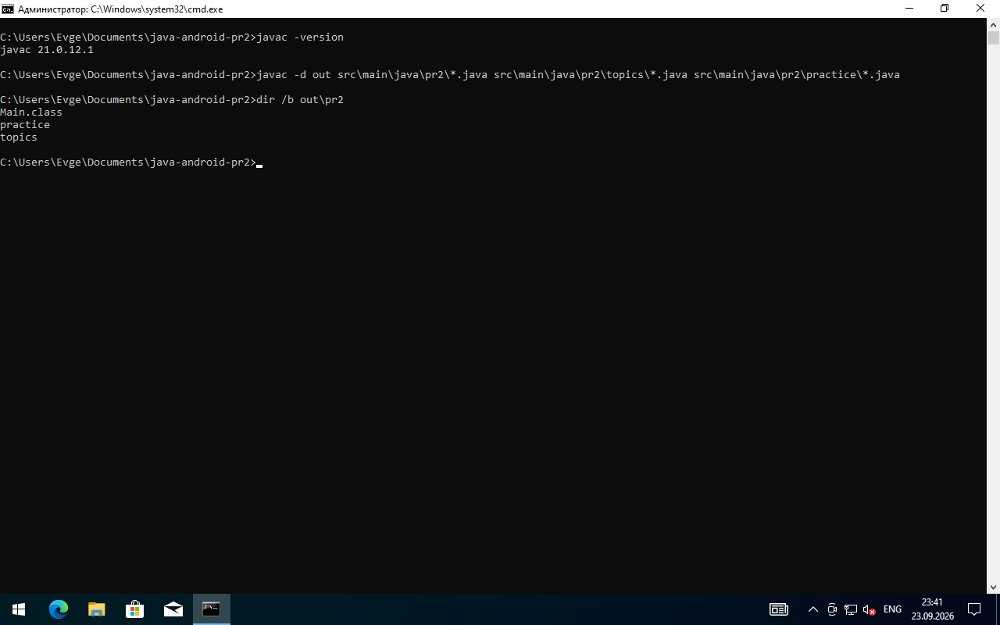
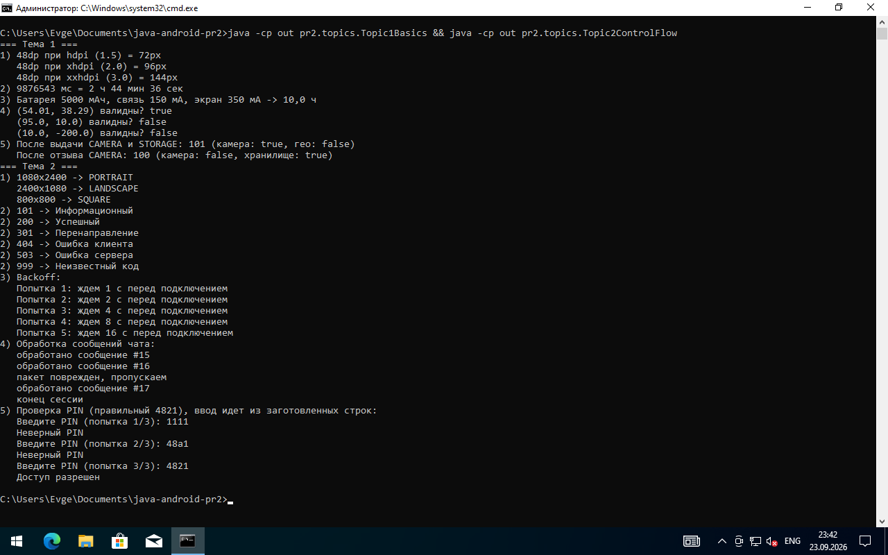
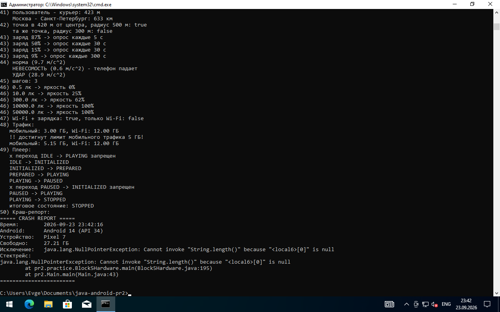

# Практическая работа №2 — Java для Android-разработки

**Дисциплина:** Разработка мобильных приложений
**Студент:** Куликов Евгений Анатольевич
**Группа:** П24-3.2

Задание: [task_2.md](https://github.com/U5er01Task/DMA-2026/blob/main/task_2.md)

## Что сделано

- Темы 1–9 — по 5 заданий на закрепление (всего 45)
- Практические задания — все 50, разбиты на 5 блоков как в задании

Все задания консольные, у каждого класса есть свой `main`, а `pr2.Main` запускает всё подряд.

## Окружение

- Windows 10
- JDK 21 (Eclipse Temurin)
- Сборка через `javac` из консоли, также есть `build.gradle.kts` (можно открыть проект в IntelliJ IDEA)

## Как запустить

Из папки проекта в cmd:

```bat
javac -d out src\main\java\pr2\*.java src\main\java\pr2\topics\*.java src\main\java\pr2\practice\*.java
java -cp out pr2.Main
```

Запустить только одну тему или блок, например тему 5:

```bat
java -cp out pr2.topics.Topic5Classes
```

Запускать нужно из корня проекта, потому что тема 9 (задание 2) читает файл `config.properties`.

## Структура проекта

```
src/main/java/pr2/
├── Main.java                  запуск всех заданий
├── topics/                    задания для закрепления по темам
│   ├── Topic1Basics.java          Тема 1. Примитивные типы и операторы
│   ├── Topic2ControlFlow.java     Тема 2. Ветвления и циклы
│   ├── Topic3Strings.java         Тема 3. Массивы и строки
│   ├── Topic4Methods.java         Тема 4. Методы, перегрузка, varargs, рекурсия
│   ├── Topic5Classes.java         Тема 5. Классы, инкапсуляция, record
│   ├── Topic6Inheritance.java     Тема 6. Наследование и полиморфизм
│   ├── Topic7Interfaces.java      Тема 7. Абстрактные классы и интерфейсы
│   ├── Topic8Collections.java     Тема 8. Коллекции и Generics
│   └── Topic9Exceptions.java      Тема 9. Исключения
└── practice/                  50 практических заданий
    ├── Block1Auth.java            1–10. Авторизация и валидация
    ├── Block2Lists.java           11–20. Списки и кэш
    ├── Block3Network.java         21–30. Сеть и офлайн-синхронизация
    ├── Block4UiState.java         31–40. Состояние экрана и UI
    └── Block5Hardware.java        41–50. Датчики, геолокация, фоновые задачи
config.properties              конфиг для темы 9
screenshots/                   скриншоты компиляции и запуска
```

## Скриншоты

### Компиляция



### Запуск





## Некоторые пояснения

- Там, где нужно текущее время (JWT-токен, таймауты сессии, блокировка после 5 попыток, дебаунс кликов), методы принимают время параметром. Так в `main` можно показать, что будет через 3 минуты или через 60 секунд, и не ждать реально.
- Классов Android (`Bundle`, `Context` и т.д.) в обычной Java нет, поэтому `Bundle` в теме 9 заменил на `Map<String, Object>`, а версию Android и модель телефона в краш-репорте (задание 50) передаю строками.
- В практическом задании 5 (маскировка email) в примере 11 звездочек, у меня звездочек столько, сколько скрыто символов (для `alexander.ivanov` это 14).
- В задании 5 темы 2 (пин-код) ввод идет не с клавиатуры, а из заготовленной строки через `Scanner`, чтобы программа не останавливалась при запуске всех заданий.
- Для LRU-кэша (тема 8, задание 5) использовал `LinkedHashMap` с `accessOrder = true` и `removeEldestEntry`.
- Состояния экрана (задание 31) сделал через `sealed interface` и `record`, а обработку — через `switch` с pattern matching (Java 21).

## Вывод

В ходе работы повторил базовый синтаксис Java, ООП (инкапсуляция, наследование, полиморфизм, абстрактные классы и интерфейсы), коллекции, дженерики и обработку исключений. Также попробовал возможности новых версий Java: `record`, `switch`-выражения, `sealed`-интерфейсы и pattern matching в `switch`.
