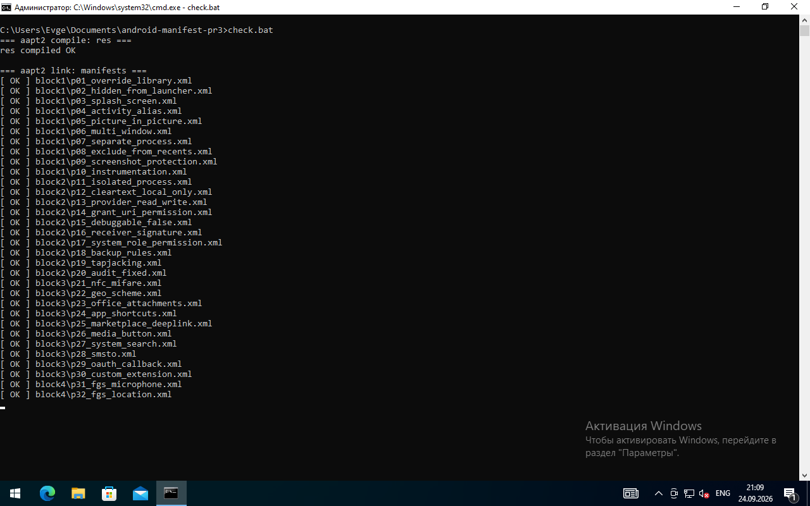
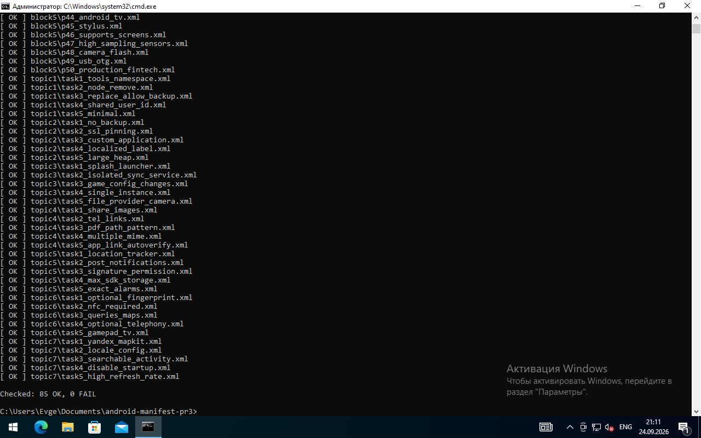
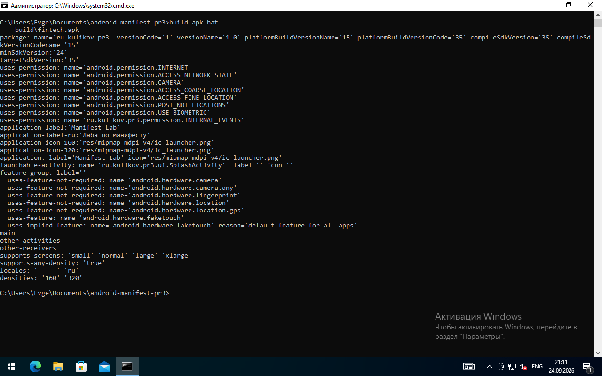

# Практическая работа №3 — Конфигурирование AndroidManifest.xml

**Дисциплина:** Разработка мобильных приложений
**Студент:** Куликов Евгений Анатольевич
**Группа:** П24-3.2

Задание: [task_3.md](https://github.com/U5er01Task/DMA-2026/blob/main/task_3.md)

## Что сделано

- Темы 1–7 — по 5 заданий на закрепление (всего 35)
- Практические задания — все 50, по 5 блокам

Каждое задание — отдельный файл `AndroidManifest.xml`. В начале каждого файла в комментарии написано, что это за задание и почему сделано именно так. Там, где в задании просят что-то объяснить (риски, правила Google Play, аудит), ответ тоже в этом комментарии.

Все манифесты проверены утилитой `aapt2` из Android SDK — это та же проверка, которую делает Gradle при сборке приложения. Если в манифесте опечатка в атрибуте или ссылка на несуществующий ресурс, `aapt2 link` выдает ошибку.

## Окружение

- Windows 10
- JDK 21 (Eclipse Temurin)
- Android SDK: command-line tools, `build-tools;35.0.0`, `platforms;android-35`

## Как проверить

Установить SDK (если нет Android Studio):

```bat
sdkmanager "build-tools;35.0.0" "platforms;android-35"
```

Проверить все 85 манифестов:

```bat
check.bat
```

Собрать APK из итогового манифеста (практика 50) и посмотреть, как его видит Android:

```bat
build-apk.bat
```

Скрипты ищут SDK в `%ANDROID_HOME%`, а если переменной нет — в `%LOCALAPPDATA%\Android\Sdk` (туда его ставит Android Studio).

APK из `build-apk.bat` не содержит кода (classes.dex), он нужен только чтобы проверить манифест и ресурсы через `aapt2 dump badging`.

## Структура проекта

```
manifests/
├── topic1/   Тема 1. Корневой тег <manifest>, tools, слияние манифестов
├── topic2/   Тема 2. Тег <application>: бэкап, SSL-pinning, largeHeap
├── topic3/   Тема 3. Activity, Service, Receiver, Provider
├── topic4/   Тема 4. Intent-фильтры и диплинки
├── topic5/   Тема 5. Разрешения
├── topic6/   Тема 6. <uses-feature> и <queries>
├── topic7/   Тема 7. <meta-data>
├── block1/   Практика 1–10.  Архитектура, слияние, запуск
├── block2/   Практика 11–20. Безопасность и сеть
├── block3/   Практика 21–30. Интент-фильтры и Deep Links
├── block4/   Практика 31–40. Сервисы и Android 14+
└── block5/   Практика 41–50. Железо, экраны, итоговый манифест
res/          ресурсы, на которые ссылаются манифесты
├── values/, values-ru/   строки на английском и русском (локализация названия)
├── values-v31/           тема Splash Screen для Android 12+
├── xml/                  network_security_config, file_paths, backup rules, searchable,
│                         shortcuts, accessibility, syncadapter, wallpaper, nfc, usb и т.д.
├── layout/               экран подтверждения платежа (защита от tapjacking)
└── mipmap-mdpi/, drawable*/   иконки и баннер для Android TV
check.bat       проверка всех манифестов через aapt2
build-apk.bat   сборка APK из практики 50
screenshots/    скриншоты
```

## Скриншоты

### Проверка манифестов (aapt2)





### Сборка APK из итогового манифеста



## Ответы на вопросы из заданий

Кратко, подробнее — в комментариях в самих файлах.

**Тема 1, задание 4 — sharedUserId.** Устарел с Android 10. Убрать его из выпущенного приложения нельзя (данные станут недоступны), поэтому в Android 13 появился `sharedUserMaxSdkVersion`. В новых приложениях лучше ContentProvider или сервис с разрешением `signature`.

**Тема 2, задание 5 — largeHeap.** Размер кучи не гарантирован, сборка мусора дольше (подвисания), приложение в фоне убивается первым, и главное — это маскирует утечки памяти. Лучше загружать картинки уменьшенными и освобождать Bitmap.

**Тема 4, задание 5 — assetlinks.json.** При установке Android скачивает `https://домен/.well-known/assetlinks.json` и сверяет package и SHA-256 отпечаток подписи. Если совпало — ссылки открываются сразу в приложении без диалога выбора.

**Тема 5, задание 5 — точные будильники.** На Android 14 `SCHEDULE_EXACT_ALARM` по умолчанию выключено. `USE_EXACT_ALARM` Google Play разрешает только будильникам, таймерам и календарям, остальным откажет в публикации.

**Тема 7, задание 5 — 120 Гц.** Стандартного meta-data для частоты экрана нет, частоту выставляет код (`preferredRefreshRate` / `preferredDisplayModeId`). Я сделал свой ключ в метаданных, который читается в `onCreate()`.

**Практика 9 — скриншоты.** Запретить скриншоты можно только в коде через `FLAG_SECURE`. Из манифеста на превью в "Недавних" влияют `excludeFromRecents`, `autoRemoveFromRecents` и отдельная `taskAffinity`.

**Практика 19 — tapjacking.** В манифесте такого атрибута нет, защита включается у View: `android:filterTouchesWhenObscured="true"` (файл `res/layout/activity_payment_confirm.xml`) и в коде `setHideOverlayWindows(true)`.

**Практика 20 — аудит.** Три уязвимости: экспортированная админ-панель без разрешения, экспортированный ContentProvider без read/writePermission, экспортированный ресивер сброса пароля без разрешения. Плюс `debuggable="true"` и `allowBackup="true"`. Исправленная версия — в `block2/p20_audit_fixed.xml`.

**Практика 33 — таймаут dataSync.** Атрибута таймаута в манифесте нет. С Android 15 система ограничивает dataSync 6 часами в сутки и вызывает `Service.onTimeout()`.

**Практика 37 — Doze.** `REQUEST_IGNORE_BATTERY_OPTIMIZATIONS` разрешено Google Play только приложениям, чья основная функция ломается в Doze (VoIP, трекеры здоровья и т.п.), иначе приложение отклонят.

**Практика 46 — низкая плотность.** `<supports-screens>` работает с размерами экрана, а не с плотностью. Отсек маленькие экраны (`smallScreens="false"`), а `<compatible-screens>` не использовал — Google не рекомендует.

## Замечания

- `${applicationId}` в authorities подставляет Gradle. При проверке через голый `aapt2` он остается строкой, на проверку это не влияет.
- Классы (`.MainApplication`, `.ui.MainActivity` и т.д.) в работе не написаны, так как задание только про манифест. `aapt2` имена классов не проверяет.
- Директивы `tools:*` (`tools:node="remove"`, `tools:replace`, `tools:overrideLibrary`) выполняет только Manifest Merger в Gradle, когда сливает наш манифест с манифестами библиотек. `aapt2` их не выполняет, а просто проверяет остальную разметку, поэтому в итоговый манифест (практика 50) я их не добавлял.
- `aapt2 dump badging` помог найти ошибку в практике 50: разрешения CAMERA и ACCESS_*_LOCATION неявно делают камеру и GPS обязательными (`uses-implied-feature`). Добавил `uses-feature ... required="false"`, чтобы приложение не пропадало из Google Play на устройствах без камеры.

## Вывод

Разобрался, как устроен AndroidManifest.xml: какие компоненты обязательно регистрировать, как работают intent-фильтры и App Links, чем нормальные разрешения отличаются от опасных и что поменялось в Android 12–15 (обязательный `exported`, типы foreground-сервисов, `POST_NOTIFICATIONS`, раздельные медиа-разрешения). Также научился проверять манифест без Android Studio — через `aapt2` из командной строки.
